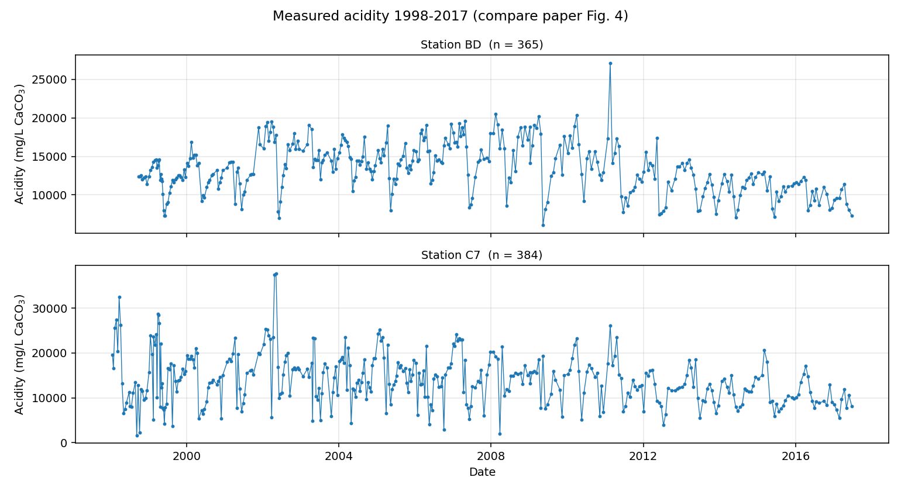
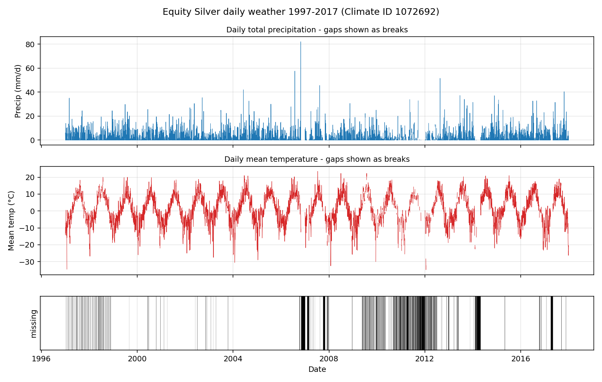
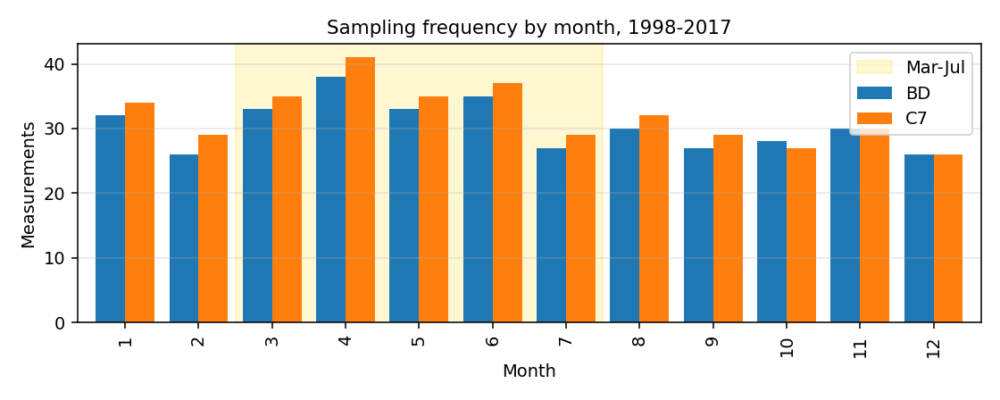

# Phase 0 - Data audit

Equity Silver waste-rock-pile replication of Ma et al. (2021).
Generated from `2017 ARD Chemisty_Clean.xlsx` and 21 Environment Canada daily CSVs.

## 1. File structure

### Weather (Environment Canada, one CSV per year)

- 21 files, `en_climate_daily_BC_1072692_1997_P1D.csv` .. `en_climate_daily_BC_1072692_2017_P1D.csv`
- Station: EQUITY SILVER (Climate ID 1072692)
- Rows: 7,670; date range 1997-01-01 to 2017-12-31
- Model inputs used: `Total Precip (mm)` -> `precip_mm`, `Mean Temp (°C)` -> `tmean_c`. All other columns are audited only.

| column       | count | mean | std  | min   | 25%  | 50%  | 75% | max  | n_missing |
|--------------|-------|------|------|-------|------|------|-----|------|-----------|
| tmax_c       | 6,754 | 5.78 | 9.42 | -30   | -1   | 5    | 13  | 30   | 916       |
| tmin_c       | 6,664 | -2.8 | 8.6  | -41.5 | -8   | -1.5 | 4   | 18   | 1006      |
| rain_mm      | 6,893 | 1.02 | 3.36 | 0     | 0    | 0    | 0   | 57.5 | 777       |
| snow_cm      | 6,895 | 0.88 | 2.94 | 0     | 0    | 0    | 0   | 82   | 775       |
| snow_grnd_cm | 4,604 | 0    | 0    | 0     | 0    | 0    | 0   | 0    | 3066      |
| precip_mm    | 6,889 | 1.9  | 4.32 | 0     | 0    | 0    | 1.8 | 82   | 781       |
| tmean_c      | 6,632 | 1.48 | 8.75 | -34.8 | -4.5 | 1.5  | 8.5 | 23.5 | 1038      |

### Acidity workbook

- File: `2017 ARD Chemisty_Clean.xlsx`
- Two sheets, one per station, mapped by config `data.acidity_sheets`:
  - `Bessmemer Dump` -> **BD** (367 data rows)
  - `C-7` -> **C7** (691 data rows)
- Three header rows: long name, unit, short field name. Data starts on Excel row 4.
- Columns: `Station Name`, `Collect Date/Time`, `ACIDITY` (mg/L as CaCO3), `PH-L`, `ZN-D`, `ZN-T`. Only `ACIDITY` is used.
- Dates are stored as Excel serial numbers (1899-12-30 origin) and are normalised to whole days.

## 2. Weather continuity

- Expected calendar days: **7,670**; rows present: **7,670**; duplicate dates: **0**
- Missing calendar *rows*: **0** - the record is continuous daily.
- Missing *values* are the real issue:

| variable  | n_missing | pct_of_record |
|-----------|-----------|---------------|
| precip_mm | 781       | 10.2          |
| tmean_c   | 1038      | 13.5          |
| either    | 1052      | 13.7          |

### Gap runs (either variable missing): 315 runs, 1,052 days

Longest 15 runs:

| start      | end        | n_days |
|------------|------------|--------|
| 2006-11-01 | 2006-12-31 | 61     |
| 2014-02-28 | 2014-04-27 | 59     |
| 2017-03-31 | 2017-05-03 | 34     |
| 2007-10-01 | 2007-10-31 | 31     |
| 2011-03-25 | 2011-04-24 | 31     |
| 2007-02-01 | 2007-02-28 | 28     |
| 2011-11-19 | 2011-12-14 | 26     |
| 2011-12-16 | 2012-01-03 | 19     |
| 2010-12-18 | 2011-01-02 | 16     |
| 2011-10-18 | 2011-11-01 | 15     |
| 2009-12-22 | 2010-01-03 | 13     |
| 2011-09-23 | 2011-10-02 | 10     |
| 2011-11-08 | 2011-11-17 | 10     |
| 2012-12-23 | 2013-01-01 | 10     |
| 2014-02-07 | 2014-02-16 | 10     |

Run-length distribution: 1 d x92, 2 d x94, 3 d x76, 4 d x26, 5 d x9, 6 d x1, 8 d x2, 10 d x4, 13 d x1, 15 d x1

### Missing days per year

| year | precip_missing | tmean_missing | either_missing |
|------|----------------|---------------|----------------|
| 1997 | 0              | 66            | 66             |
| 1998 | 9              | 68            | 71             |
| 1999 | 0              | 1             | 1              |
| 2000 | 7              | 6             | 13             |
| 2001 | 0              | 3             | 3              |
| 2002 | 4              | 6             | 10             |
| 2003 | 0              | 8             | 8              |
| 2004 | 0              | 0             | 0              |
| 2005 | 0              | 0             | 0              |
| 2006 | 61             | 68            | 68             |
| 2007 | 85             | 86            | 86             |
| 2008 | 0              | 4             | 4              |
| 2009 | 17             | 91            | 91             |
| 2010 | 91             | 124           | 124            |
| 2011 | 243            | 243           | 243            |
| 2012 | 105            | 105           | 105            |
| 2013 | 19             | 19            | 19             |
| 2014 | 80             | 80            | 80             |
| 2015 | 4              | 4             | 4              |
| 2016 | 13             | 13            | 13             |
| 2017 | 43             | 43            | 43             |

Worst years: **2011** (243 d), **2010** (124 d), **2012** (105 d), **2009** (91 d), **2007** (86 d)

- Station name and Climate ID never change over the record, so no station splice has to be handled.

## 3. Weather quality flags

- **precip**: `(none)` x7,289, `C` x146, `T` x105, `A` x100, `M` x20, `E` x9, `F` x1
- **tmean**: `(none)` x7,372, `M` x254, `E` x44

Environment Canada flag meanings: `M` missing, `T` trace, `E` estimated, `A` accumulated, `C` precipitation occurred but amount uncertain, `F` accumulated and estimated.

### Precipitation flag vs missing value

| precip_flag | has_value | is_nan |
|-------------|-----------|--------|
| (none)      | 6528      | 761    |
| A           | 100       | 0      |
| C           | 146       | 0      |
| E           | 9         | 0      |
| F           | 1         | 0      |
| M           | 0         | 20     |
| T           | 105       | 0      |

### Mean-temperature flag vs missing value

| tmean_flag | has_value | is_nan |
|------------|-----------|--------|
| (none)     | 6588      | 784    |
| E          | 44        | 0      |
| M          | 0         | 254    |

**Findings:**

1. Every `T` (trace) row already carries [0.0] mm, so the configured `T -> 0 mm` rule is a no-op safeguard, not a change to the data.
2. Every `M` row is already blank, so the `M -> NaN` rule is also a no-op safeguard.
3. **The bulk of missing data carries no flag at all**: 761 blank-and-unflagged precipitation days and 784 for mean temperature, against only 20 and 254 explicit `M` flags. These are treated as missing (NaN) and never imputed.
4. `A`/`C`/`F` precipitation rows do carry values and are kept as recorded; flagging them out would enlarge the gaps further.

## 4. Acidity dates

- Rows read: **1,058**; rows with an unparseable or missing date: **0**.
- Every retained value therefore has a full calendar date; no month-only or year-only entries were found.
- Full-file date span: 1986-10-08 to 2017-06-22.
- Rows outside the 1998-2017 study window (dropped): **304** - almost entirely C7 measurements from 1986-1997.

## 5. Acidity counts vs the paper

| station | ours | paper | difference |
|---------|------|-------|------------|
| BD      | 365  | 365   | 0          |
| C7      | 384  | 384   | 0          |

**Exact match with the paper for both stations.** This is a strong confirmation that the data source, the 1998-2017 window and the blank-dropping rule all match Ma et al.

### Measurements per station per year

| year | BD | C7 |
|------|----|----|
| 1998 | 7  | 24 |
| 1999 | 32 | 33 |
| 2000 | 22 | 22 |
| 2001 | 17 | 17 |
| 2002 | 23 | 23 |
| 2003 | 19 | 20 |
| 2004 | 25 | 25 |
| 2005 | 24 | 24 |
| 2006 | 23 | 23 |
| 2007 | 22 | 22 |
| 2008 | 16 | 16 |
| 2009 | 16 | 16 |
| 2010 | 16 | 16 |
| 2011 | 16 | 16 |
| 2012 | 16 | 16 |
| 2013 | 17 | 17 |
| 2014 | 16 | 16 |
| 2015 | 15 | 15 |
| 2016 | 15 | 15 |
| 2017 | 8  | 8  |

1998 and 2017 are partial years: BD starts 1998-10-02 and both stations stop at 2017-06-22. Sampling thins from roughly 23-25 per year before 2008 to 15-17 per year afterwards.

## 6. Acidity data quality

- Non-numeric / blank `ACIDITY` entries dropped: **5**

| station | date       | sheet          | excel_row |
|---------|------------|----------------|-----------|
| BD      | 2000-09-20 | Bessmemer Dump | 60        |
| BD      | 2007-08-02 | Bessmemer Dump | 212       |
| C7      | 1993-02-04 | C-7            | 159       |
| C7      | 1993-02-25 | C-7            | 162       |
| C7      | 2007-08-02 | C-7            | 536       |

These are genuinely blank cells, not censored values (no `<`, `>` or `ND` text appears anywhere in the column).

- Same-day duplicate measurements (rows involved): **0**
  - None. The `same_day_duplicates: mean` policy never fires, so that ambiguity does not affect this replication.

### Value range (mg/L as CaCO3)

| station | count | mean      | std   | min   | 25%      | 50%      | 75%       | max       |
|---------|-------|-----------|-------|-------|----------|----------|-----------|-----------|
| BD      | 365   | 1.341e+04 | 3,176 | 6,080 | 1.14e+04 | 1.32e+04 | 1.565e+04 | 2.71e+04  |
| C7      | 384   | 1.407e+04 | 5,613 | 1,677 | 1.01e+04 | 1.37e+04 | 1.73e+04  | 3.776e+04 |

Paper Fig. 4 shows values mostly between 5,000 and 30,000 mg/L with occasional peaks near 40,000.
- **BD**: 0 values outside 5,000-30,000 (0%), 0 above 40,000, min 6,080, max 27,100.
- **C7**: 13 values outside 5,000-30,000 (3%), 0 above 40,000, min 1,677, max 37,763.

- Non-positive values: **0**.

## 7. Seasonality of sampling

| month | BD | C7 | total |
|-------|----|----|-------|
| 1     | 32 | 34 | 66    |
| 2     | 26 | 29 | 55    |
| 3     | 33 | 35 | 68    |
| 4     | 38 | 41 | 79    |
| 5     | 33 | 35 | 68    |
| 6     | 35 | 37 | 72    |
| 7     | 27 | 29 | 56    |
| 8     | 30 | 32 | 62    |
| 9     | 27 | 29 | 56    |
| 10    | 28 | 27 | 55    |
| 11    | 30 | 30 | 60    |
| 12    | 26 | 26 | 52    |

March-July holds **343 of 749** measurements (46%) in 5 of 12 months, confirming the paper's statement that sampling is more frequent from March to July (the freshet).

## 8. Samples surviving the complete-window rule

A sample is kept only if **every** day of its lookback window has both precipitation and mean temperature: 10 days for Type A, 70 days for Type B. Nothing is imputed (CLAUDE.md rule 8).

| station | type | candidates | surviving | dropped | pct_kept |
|---------|------|------------|-----------|---------|----------|
| BD      | A    | 365        | 274       | 91      | 75.1     |
| BD      | B    | 365        | 185       | 180     | 50.7     |
| C7      | A    | 384        | 278       | 106     | 72.4     |
| C7      | B    | 384        | 186       | 198     | 48.4     |

- **BD**: Type B survivors are a subset of Type A survivors; |A n B| = 185, A-only = 89, B-only = 0.
- **C7**: Type B survivors are a subset of Type A survivors; |A n B| = 186, A-only = 92, B-only = 0.

### Consequence for the replication

The paper applies the same rule and says so explicitly:

> As some weather data are missing at the Equity Silver site, not all acidity measurements at C7 and BD stations are utilized for building the observation samples for machine learning. Those acidity measurements without a complete time series input data will be neglected.

So Ma et al. dropped rather than gap-filled, which matches our implementation. **They never report the surviving counts**, so the open question is only how large their surviving sets were.

Type B loses substantially more than Type A, leaving as few as **185** samples for one station. With a 70/15/15 split that is roughly **28 test samples** - a thin basis for the reported test metrics, and a reason to expect noisy run-to-run scatter in Phase 6.

Two consequences to keep in mind:

1. Type A and Type B are **not** trained on the same samples under the default `common_sample_set: false`. Type B is a strict subset of Type A here, so part of any Type B vs Type A difference is a change of sample set, not of input representation. The `common_sample_set: true` run in Phase 6 isolates this.
2. Losses are concentrated in 2006-2014 (the worst weather-gap years), so the surviving samples are not uniformly spread over the study period.

### Surviving samples per year

| year | BD-all | C7-all | BD-A | BD-B | C7-A | C7-B |
|------|--------|--------|------|------|------|------|
| 1998 | 7      | 24     | 2    | 0    | 4    | 0    |
| 1999 | 32     | 33     | 31   | 25   | 32   | 26   |
| 2000 | 22     | 22     | 19   | 11   | 19   | 11   |
| 2001 | 17     | 17     | 16   | 9    | 16   | 9    |
| 2002 | 23     | 23     | 19   | 13   | 19   | 13   |
| 2003 | 19     | 20     | 16   | 6    | 17   | 6    |
| 2004 | 25     | 25     | 25   | 25   | 25   | 25   |
| 2005 | 24     | 24     | 24   | 24   | 24   | 24   |
| 2006 | 23     | 23     | 18   | 18   | 18   | 18   |
| 2007 | 22     | 22     | 12   | 0    | 12   | 0    |
| 2008 | 16     | 16     | 15   | 12   | 15   | 12   |
| 2009 | 16     | 16     | 9    | 4    | 9    | 4    |
| 2010 | 16     | 16     | 3    | 0    | 3    | 0    |
| 2011 | 16     | 16     | 0    | 0    | 0    | 0    |
| 2012 | 16     | 16     | 6    | 0    | 6    | 0    |
| 2013 | 17     | 17     | 14   | 6    | 14   | 6    |
| 2014 | 16     | 16     | 11   | 8    | 11   | 8    |
| 2015 | 15     | 15     | 15   | 12   | 15   | 12   |
| 2016 | 15     | 15     | 14   | 12   | 14   | 12   |
| 2017 | 8      | 8      | 5    | 0    | 5    | 0    |

Worst years for BD Type B losses: **2007** (-22), **2010** (-16), **2011** (-16), **2012** (-16), **2003** (-13). 2011 loses every sample at both stations.

Years with **no** surviving BD Type B sample at all: 1998, 2007, 2010, 2011, 2012, 2017.

**Implications for later phases:**

- **Phase 9 (forecast)** is feasible: BD Type B has **161** surviving samples in 1999-2014 for training and **24** in 2015-2016 to predict. Both are usable, though 24 prediction points is a small basis for the paper's 0.23 MSE target.
- **Phase 5 blocked splits** cannot simply hold out whole years: 1998, 2007, 2010, 2011, 2012, 2017 are empty for BD Type B. The blocked splitter must draw from years that actually contain surviving samples.

## 9. Figures

*Acidity at BD and C7, 1998-2017.*

*Daily precipitation and mean temperature; the bottom strip marks days where either variable is missing.*

*Sampling concentrates in the March-July freshet.*

