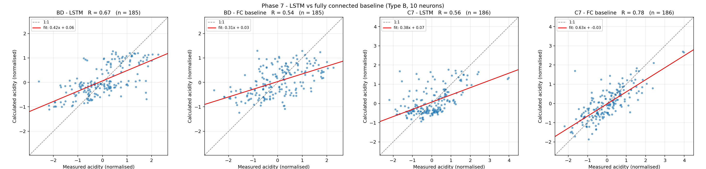

# Phase 7 - Fully connected baseline

The baseline follows Ma et al. (2020a): the Type B window (10 steps x 2 features) is flattened to 20 values, then `Linear(20, 10)` -> tanh -> `Linear(10, 1)`. The paper does not state the activation; tanh is MATLAB's default for this kind of network and is recorded as an assumption (DEVIATIONS.md D-09).

Both models use the **same samples, the same splits, the same scaler and the same 5 repeats**, so their metrics are directly comparable (DEVIATIONS.md D-18).

## R as the paper reports it (all samples, best of 5)

| station | LSTM R (ours) | LSTM R (paper) | FC R (ours) | FC R (paper) | LSTM - FC (ours) | LSTM - FC (paper) |
|---------|---------------|----------------|-------------|--------------|------------------|-------------------|
| BD      | 0.67          | 0.7            | 0.54        | 0.64         | 0.13             | 0.06              |
| C7      | 0.56          | 0.51           | 0.78        | 0.42         | -0.22            | 0.09              |

**BD reproduces the paper's ordering. C7 does not**: our FC baseline reaches R = 0.78 over all samples, well above both our LSTM (0.56) and the paper's FC value (0.42). That number does not survive scrutiny, and the next two sections explain why.

## Why the all-sample R is misleading here

All-sample metrics are dominated by the training rows - about 68% of the samples. A model that memorises its training set therefore scores well on them. Worse, **best-of-5 selection uses MSE over all samples** (the paper's stated rule, and the reading adopted in CLAUDE.md), so among the five repeats it actively prefers the one that overfits hardest.

Mean over the 5 repeats:

| station | model       | train MSE | test MSE | gap (test - train) | train R | test R | epochs |
|---------|-------------|-----------|----------|--------------------|---------|--------|--------|
| BD      | LSTM        | 0.546     | 0.88     | 0.335              | 0.691   | 0.454  | 18.8   |
| BD      | FC baseline | 0.662     | 1.033    | 0.371              | 0.595   | 0.318  | 8.8    |
| C7      | LSTM        | 0.771     | 0.834    | 0.062              | 0.569   | 0.187  | 20.2   |
| C7      | FC baseline | 0.457     | 0.754    | 0.297              | 0.774   | 0.362  | 35     |

The selected C7 FC run is the clearest case: train MSE 0.286 (R 0.871) against test MSE 0.861 (R 0.392) - a train-to-test gap of 0.575. It also trained for 59 epochs, against 20 on average for the LSTM. Its headline R of 0.78 is largely memorised training data.

## The honest comparison: held-out test samples only

Mean test-split R over the 5 repeats:

| station | n_test | LSTM test R | FC test R | LSTM - FC | winner      |
|---------|--------|-------------|-----------|-----------|-------------|
| BD      | 29     | 0.454       | 0.318     | 0.136     | LSTM        |
| C7      | 30     | 0.187       | 0.362     | -0.175    | FC baseline |

**At BD the LSTM wins on held-out data as the paper reports. At C7 it still loses.** So C7 is not purely a selection artefact: the FC baseline really does generalise better there.

The reason is on the other side: **our C7 LSTM underfits**. Its train MSE (0.771) is barely below its test MSE (0.834), a gap of only 0.062 against 0.335 for the BD LSTM. It is not learning the training set, let alone overfitting it.

Two caveats on how far to push this:

1. The C7 test split holds only 30 samples, so test R is noisy (SD 0.050 across repeats).
2. C7 test R (0.19) is far below C7 validation R (0.59), which suggests this particular test fold is unusually hard rather than the model being uniformly poor.

## Full metrics (best of 5)

| station | model       | params | n   | MSE all | MSE mean+-sd | R all | MSE train | MSE test | R test | RMSE mg/L |
|---------|-------------|--------|-----|---------|--------------|-------|-----------|----------|--------|-----------|
| BD      | FC baseline | 221    | 185 | 0.716   | 0.755+-0.025 | 0.536 | 0.627     | 0.981    | 0.379  | 2461      |
| BD      | LSTM        | 571    | 185 | 0.56    | 0.596+-0.047 | 0.667 | 0.495     | 0.917    | 0.432  | 2177      |
| C7      | FC baseline | 221    | 186 | 0.398   | 0.524+-0.101 | 0.777 | 0.286     | 0.861    | 0.392  | 3655      |
| C7      | LSTM        | 571    | 186 | 0.711   | 0.747+-0.031 | 0.556 | 0.699     | 0.929    | 0.14   | 4880      |

The FC baseline has 221 parameters against the LSTM's 571. The LSTM's advantage at BD is therefore not a capacity effect - it comes from processing the window as an ordered sequence rather than as 20 unordered numbers.

## Figure

*Measured vs calculated acidity, normalised, all samples, best run of 5. Note that the C7 FC panel looks tight mainly because most of those points are training samples it has memorised.*

## Qualitative finding 3: does the LSTM beat the FC baseline?

| station | LSTM wins on all-sample R | LSTM wins on test R | paper |
|---------|---------------------------|---------------------|-------|
| BD      | yes                       | yes                 | yes   |
| C7      | no                        | no                  | yes   |

**Verdict: PARTIALLY REPLICATED - holds at BD, fails at C7.**

At BD the LSTM beats the FC baseline on both the paper's metric and on held-out data, and the size of the gap (+0.13 all-sample R) is close to the paper's +0.06. At C7 the result inverts, driven by an LSTM that underfits rather than by an unusually strong baseline.

This is a genuine partial non-replication and is **not** patched by tuning: CLAUDE.md forbids going beyond the paper's stated settings, and doing so would invalidate the comparison with Table 1. It is carried into the Phase 11 report as an open discrepancy.

It also exposes a weakness in the paper's own methodology: reporting R over all samples, and selecting the best of five runs by all-sample MSE, both reward overfitting. Ma et al.'s FC baseline R of 0.42-0.64 may well be depressed or inflated by the same effect, and their reported LSTM advantage cannot be checked against held-out data from the paper alone.

