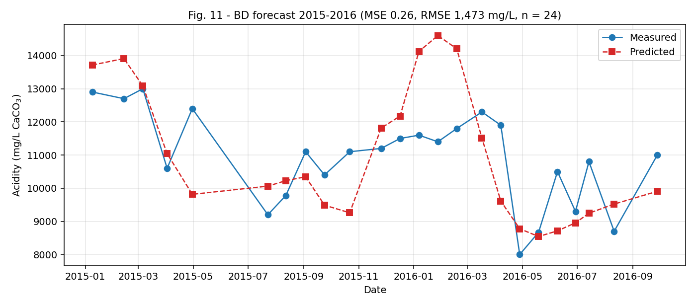
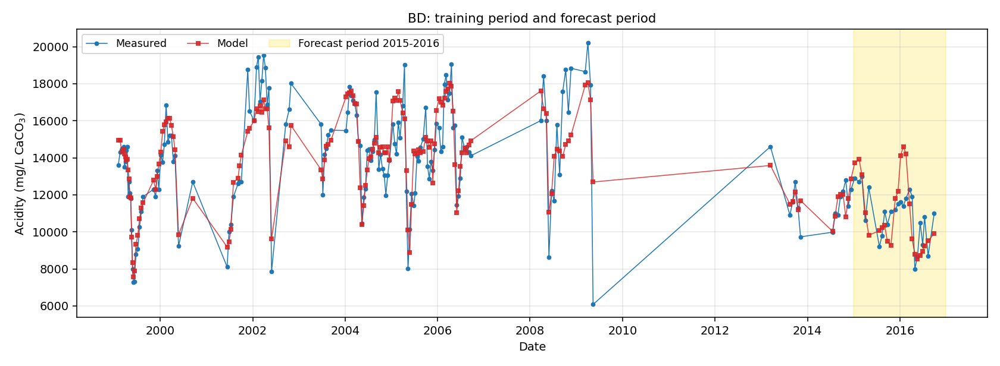
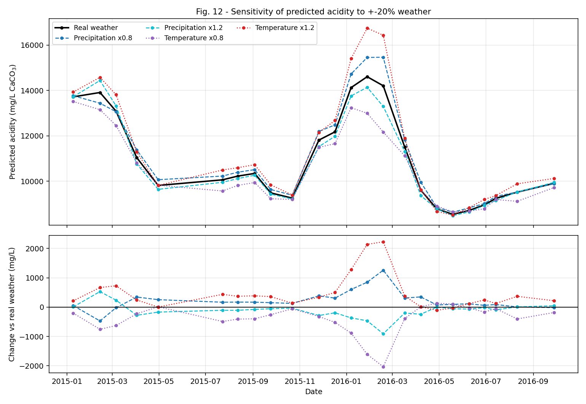

# Phases 9-10 - Forecast and sensitivity

## Setup

The refined model (station BD, Type B, H = 10, with the day-number time tag) is trained on samples dated **1999-2014** only, with a random 80/20 train/validation split and no test set, then used to predict every **2015-2016** sample from the actual weather.

| period               | n_samples |
|----------------------|-----------|
| train 1999-2014      | 129       |
| validation 1999-2014 | 32        |
| forecast 2015-2016   | 24        |

1998 and 2017 are excluded as in the paper; in this dataset neither year has a surviving Type B sample anyway, so nothing is actually discarded.

Three methodological points, all deliberate:

1. **The scaler is fitted on 1999-2014 only** (161 samples). This is the honest choice for a forecast and departs from the paper's fit-on-all default.
2. **Best-of-5 is selected on train+validation MSE**, never on the forecast period. Selecting on the forecast would leak the very answer being measured.
3. **These MSEs are not comparable with Table 1's.** Normalised MSE is expressed in units of the fitted standard deviation, and this scaler differs from the Phase 6-8 one (DEVIATIONS.md D-18). They are comparable with the paper's forecast figures, which use the same construction, and with each other.

Windows for early-2015 samples reach back into late-2014 weather, which is expected and allowed: that weather is a genuine input, not a label.

## Forecast results

| quantity                | ours  | paper | difference |
|-------------------------|-------|-------|------------|
| MSE, train + validation | 0.253 | 0.28  | -0.027     |
| MSE, forecast period    | 0.265 | 0.23  | 0.035      |

| split | n   | MSE   | R     | RMSE mg/L |
|-------|-----|-------|-------|-----------|
| train | 129 | 0.241 | 0.873 | 1406      |
| val   | 32  | 0.301 | 0.828 | 1571      |
| test  | 24  | 0.265 | 0.663 | 1473      |

The selected run reaches **RMSE 1,473 mg/L** over the forecast period, against measured values averaging about 10,910 mg/L - roughly 13% relative error.

## Spread across the 5 seeds - read this before the headline

| seed | train+val MSE | forecast MSE | forecast RMSE mg/L | selected |
|------|---------------|--------------|--------------------|----------|
| 42   | 0.317         | 0.432        | 1884               |          |
| 43   | 0.353         | 0.569        | 2161               |          |
| 44   | 0.35          | 0.56         | 2143               |          |
| 45   | 0.253         | 0.265        | 1473               | yes      |
| 46   | 0.34          | 0.526        | 2077               |          |

Forecast-period MSE across the five seeds: mean **0.470**, SD **0.127**, range **0.265 to 0.569**.

**The headline 0.265 is the best of the five, and the typical run is about 0.47** - roughly double the paper's 0.23. The selection rule is honest (train+validation only), so this is luck rather than leakage: the run that fitted the training period best also happened to forecast best.

With only 24 forecast samples and a spread this wide, a single reported number carries little weight. The paper reports one value for its forecast and does not give a spread, so we cannot tell where its 0.23 sits in its own distribution.

## The time tag extrapolates here

This is the point CLAUDE.md flags, and it is worth being precise about. The tag is a monotonically increasing day number, and the forecast period lies entirely beyond the training range:

| period   | day number range | normalised range |
|----------|------------------|------------------|
| training | 400 to 6,189     | -1.34 to +2.53   |
| forecast | 6,218 to 6,846   | +2.55 to +2.97   |

Every forecast sample carries a tag value larger than any seen in training, reaching 2.97 standard deviations against a training maximum of 2.53. The network has no evidence about what acidity does in that range and can only continue whatever trend it fitted.

Phase 8 found that the tag's benefit survived a blocked split, but that test held out years *inside* the training range, so it was still interpolation. This is the first true extrapolation test, and the wide seed-to-seed spread above is consistent with a feature the model cannot constrain outside its training range.

**Practical reading:** the forecast works here partly because BD acidity was declining steadily through the late training period and continued to decline through 2015-2016. A trend-following tag extrapolates well when the trend persists. It would be unsafe to rely on this for a period where the trend changes.

## Figures

*Fig. 11 - measured and predicted acidity over the forecast period, in mg/L.*

*Supplementary: the whole modelled span, with the forecast period shaded. The model tracks the training period closely - it was fitted there - and the forecast continues without an obvious discontinuity.*

## Phase 10 - Sensitivity to +-20% weather

The Phase 9 model and its scaler are used unchanged. The raw daily values for **2015-01-01 to 2016-12-31 only** are multiplied by 0.8 and 1.2, one variable at a time - precipitation in mm and mean temperature in degrees C - and the windows are rebuilt from the perturbed series. Days before the forecast period keep their real weather.

Scaling temperature in degrees C amplifies summer highs and winter lows together, which is what the paper means by a larger 'temperature fluctuation'.

| scenario           | mean predicted (mg/L) | change (mg/L) | change (%) |
|--------------------|-----------------------|---------------|------------|
| Real weather       | 10944                 | 0             | 0          |
| Precipitation x0.8 | 11169                 | 225           | 2.05       |
| Precipitation x1.2 | 10822                 | -122          | -1.12      |
| Temperature x0.8   | 10537                 | -408          | -3.73      |
| Temperature x1.2   | 11416                 | 472           | 4.31       |

*Fig. 12 - five prediction curves. The lower panel shows each scenario's difference from the real-weather prediction, which is where the effects are legible.*

### Directions

| paper's expectation                        | our result                                 | holds? |
|--------------------------------------------|--------------------------------------------|--------|
| More precipitation -> lower acidity        | -122 mg/L at x1.2, +225 at x0.8            | yes    |
| Larger temperature swing -> higher acidity | +472 mg/L at x1.2, -408 at x0.8            | yes    |
| Temperature is the more sensitive input    | 8.0% total swing vs 3.2% for precipitation | yes    |

The precipitation response is mildly asymmetric (+2.1% at x0.8 against -1.1% at x1.2), which is expected from a non-linear model and not a sign of trouble.

**Caveat on magnitude.** These are single-model responses from the one selected network. Given the seed-to-seed spread in the forecast itself, the *directions* are the robust finding; the percentage magnitudes should not be read as calibrated sensitivities.

## Qualitative findings 5 and 6

**Finding 5 - the forecast is reasonable: REPLICATED.** Forecast MSE 0.26 against the paper's 0.23, and train+validation 0.25 against 0.28. Both are close. The qualification is the seed spread (0.26 to 0.57): the headline is the best of five, not a typical run.

**Finding 6 - the sensitivity directions hold: REPLICATED (3/3).** More precipitation lowers acidity, a larger temperature swing raises it, and temperature is the more sensitive input - all three as the paper reports.

