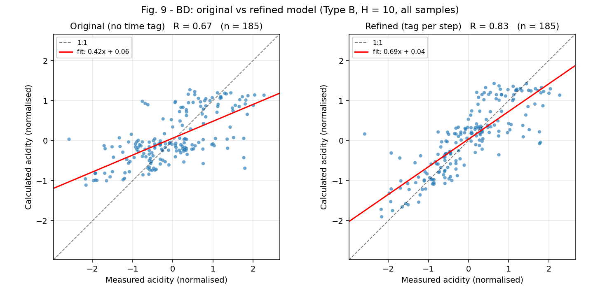
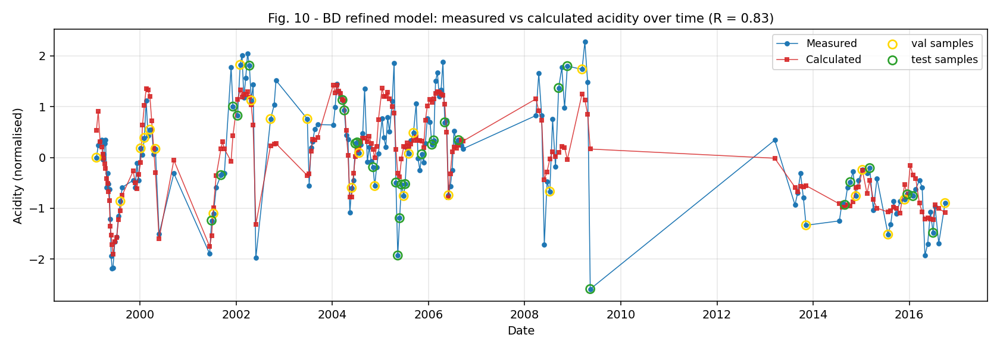
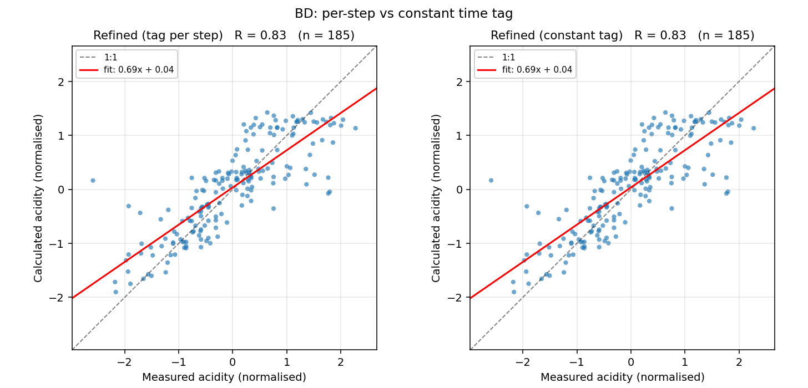

# Phase 8 - Refined model with the time tag

Station BD, Type B, H = 10, with the day number as a third input feature. Day 1 is 1998-01-01. All other settings are as in Phase 6.

The time tag does not change which samples survive the complete-window rule (verified in Phase 2), so the output scaler is identical with and without it and the MSEs are directly comparable (DEVIATIONS.md D-18).

## Original vs refined, against the paper

| model              | R (ours) | R (paper) | MSE (ours) | MSE (paper) |
|--------------------|----------|-----------|------------|-------------|
| Original (no tag)  | 0.67     | 0.7       | 0.56       | 0.54        |
| Refined (time tag) | 0.83     | 0.86      | 0.32       | 0.26        |
| Improvement        | 0.16     | 0.16      | -0.24      | -0.28       |

The time tag improves the fit substantially, as the paper reports: R rises 0.67 -> 0.83 and MSE falls 0.56 -> 0.32.

## Both time-tag variants

`per_step` gives each step its own day number (the week's last day for Type B); `constant` gives every step the sample's own day number.

| station | model                  | features | MSE all | MSE mean+-sd | R all | MSE test | R test | RMSE mg/L |
|---------|------------------------|----------|---------|--------------|-------|----------|--------|-----------|
| BD      | Original (no time tag) | 2        | 0.56    | 0.596+-0.047 | 0.667 | 0.917    | 0.432  | 2177      |
| BD      | Refined (tag per step) | 3        | 0.318   | 0.417+-0.079 | 0.826 | 0.709    | 0.625  | 1642      |
| BD      | Refined (constant tag) | 3        | 0.318   | 0.416+-0.078 | 0.826 | 0.709    | 0.625  | 1642      |
| C7      | Original (no time tag) | 2        | 0.711   | 0.747+-0.031 | 0.556 | 0.929    | 0.14   | 4880      |
| C7      | Refined (tag per step) | 3        | 0.555   | 0.608+-0.090 | 0.672 | 0.921    | 0.266  | 4314      |
| C7      | Refined (constant tag) | 3        | 0.555   | 0.609+-0.090 | 0.672 | 0.921    | 0.266  | 4315      |

**The two variants give essentially the same model** (0.318 vs 0.318 MSE, R 0.826 vs 0.826), and this is not a coincidence.

A Type B window spans 63 days, so `per_step` and `constant` differ by at most 63 in day number. The tag is z-scored over the whole 1998-2017 range, where its standard deviation is about 1,963 days. The two encodings therefore differ by at most **3.2% of one standard deviation**. Measured directly, the within-window spread of the normalised tag averages about **1% of the between-sample spread**.

In other words the tag acts almost purely as a per-sample index; how it is distributed across the ten steps is irrelevant at this scale. The `time_tag` ambiguity in CLAUDE.md is therefore **immaterial** - either setting gives the same answer. `per_step` remains the configured default.

**Supplementary (C7, beyond the paper's scope):** the tag helps there too, R 0.56 -> 0.67 and MSE 0.71 -> 0.56, so the effect is not specific to BD.

## Figures

*Fig. 9 - original vs refined, measured against calculated acidity, normalised, all samples, with fit lines and R.*

*Fig. 10 - refined model over time. Validation and test samples are ringed.*

*Supplementary: per-step against constant time tag.*

## What is the time tag actually learning?

The tag is a monotonically increasing index, not a weather variable. Phase 0 showed that BD acidity has a clear long-term shape - rising to about 2008, then declining - which no 10-week weather window can express. The tag lets the network fit that trend directly.

That is a real gain in fit, but it is worth being precise about what kind of gain it is. Under the paper's **random** split, samples from across the whole period appear in training, so at test time the model only has to **interpolate** the trend between dates it has already seen. That is a much easier problem than extrapolating it.

The blocked split probes this: whole calendar years are held out, so the model must predict dates it never saw. Note that most held-out years sit *inside* the training range, so this is still interpolation in time - just to unseen dates. True extrapolation beyond the training range is only tested in Phase 9.

| model                  | R all (random split) | R all (blocked split) | test R (random) | test R (blocked) |
|------------------------|----------------------|-----------------------|-----------------|------------------|
| Original (no time tag) | 0.667                | 0.65                  | 0.454           | 0.228            |
| Refined (tag per step) | 0.826                | 0.827                 | 0.528           | 0.322            |

The tag's advantage on **held-out test samples** is **+0.074 R under the random split** but **+0.094 under the blocked split**.

The gain survives the blocked split, so the tag carries more than an interpolatable trend.

**This matters directly for Phase 9.** The forecast trains on 1999-2014 and predicts 2015-2016, so the tag must extrapolate beyond every day number it ever saw. The blocked-split result above is the closest advance warning of how well that will work.

## Qualitative finding 4: does the time tag improve the fit substantially?

**Verdict: REPLICATED.** R 0.67 -> 0.83 (+0.16), against the paper's 0.70 -> 0.86 (+0.16). MSE 0.56 -> 0.32, against the paper's 0.54 -> 0.26.

The improvement is **the same size as the paper's**: +0.16 R against +0.16. Both the starting and finishing levels sit slightly below the paper's (R 0.67 -> 0.83 against 0.70 -> 0.86; MSE 0.32 against 0.26), which is the same small offset seen throughout Table 1 rather than anything specific to the time tag.

The caveat from the previous section stands: much of the gain is the model fitting a long-term trend it can interpolate, so the refined model should not be read as having learned more about the weather-chemistry relationship.

