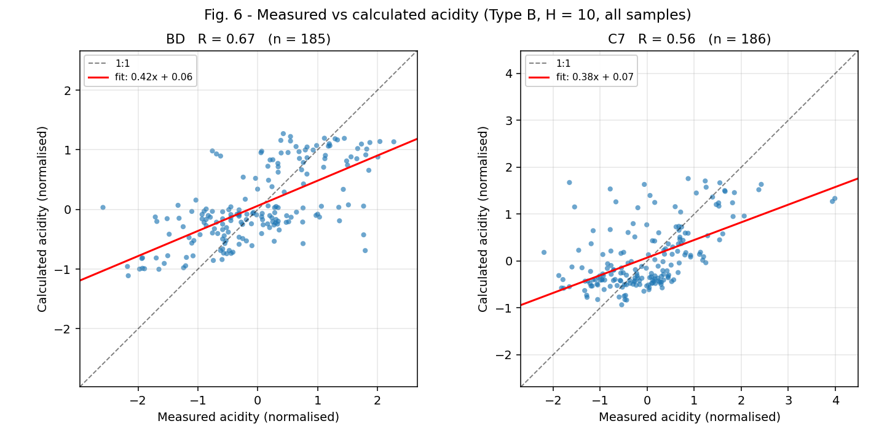
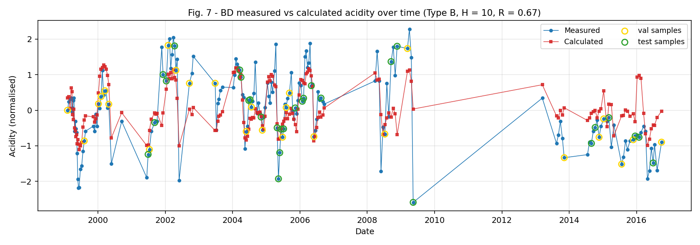
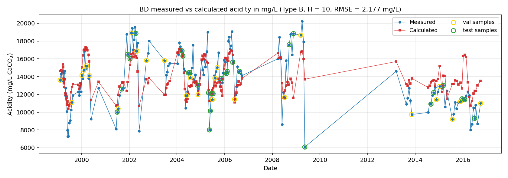

# Phase 6 - Parametric study (paper Table 1, Figs 6-7)

Grid: station {BD, C7} x input type {A, B} x hidden size {5, 10, 20} x 5 repeats. Best-of-5 selection uses MSE over **all** samples, matching how Table 1 reports the lowest MSE. All MSEs are in normalised units.

## Table 1 - best-of-5 MSE against the paper

| station | type | ours H=5 | ours H=10 | ours H=20 | paper H=5 | paper H=10 | paper H=20 |
|---------|------|----------|-----------|-----------|-----------|------------|------------|
| BD      | A    | 0.783    | 0.763     | 0.777     | 0.79      | 0.76       | 0.76       |
| BD      | B    | 0.608    | 0.56      | 0.548     | 0.59      | 0.54       | 0.54       |
| C7      | A    | 0.805    | 0.827     | 0.836     | 0.85      | 0.83       | 0.81       |
| C7      | B    | 0.736    | 0.711     | 0.695     | 0.77      | 0.74       | 0.73       |

**Largest absolute deviation from the paper: 0.045** (mean 0.020). 12 of 12 cells agree to within 0.05 MSE.

CLAUDE.md warns against chasing exact numbers: with ~185-278 samples per station and best-of-5 selection, this level of agreement is as close as the design allows. No tuning beyond the paper's stated settings was done.

## Spread across the 5 repeats

| station | type | hidden | best  | mean  | sd    | paper | best_seed | epochs_mean |
|---------|------|--------|-------|-------|-------|-------|-----------|-------------|
| BD      | A    | 5      | 0.783 | 0.807 | 0.027 | 0.79  | 45        | 8.6         |
| BD      | A    | 10     | 0.763 | 0.782 | 0.012 | 0.76  | 44        | 14.8        |
| BD      | A    | 20     | 0.777 | 0.793 | 0.015 | 0.76  | 46        | 7           |
| BD      | B    | 5      | 0.608 | 0.668 | 0.052 | 0.59  | 42        | 23.2        |
| BD      | B    | 10     | 0.56  | 0.596 | 0.047 | 0.54  | 45        | 18.8        |
| BD      | B    | 20     | 0.548 | 0.595 | 0.075 | 0.54  | 46        | 17.6        |
| C7      | A    | 5      | 0.805 | 0.836 | 0.019 | 0.85  | 43        | 17          |
| C7      | A    | 10     | 0.827 | 0.834 | 0.005 | 0.83  | 42        | 8.4         |
| C7      | A    | 20     | 0.836 | 0.843 | 0.007 | 0.81  | 46        | 7.6         |
| C7      | B    | 5      | 0.736 | 0.76  | 0.047 | 0.77  | 45        | 21          |
| C7      | B    | 10     | 0.711 | 0.747 | 0.031 | 0.74  | 44        | 20.2        |
| C7      | B    | 20     | 0.695 | 0.724 | 0.023 | 0.73  | 42        | 26.2        |

Run-to-run SD averages 0.030 MSE, which is comparable to the 0.020 mean gap to the paper. Differences of that size between hidden sizes are therefore within noise, and the paper's own best-of-5 figures carry the same uncertainty.

## MSE and R for each split (best run of 5)

| station | type | hidden | n   | n_train | n_val | n_test | MSE train | MSE val | MSE test | R train | R val | R test | R all | RMSE mg/L |
|---------|------|--------|-----|---------|-------|--------|-----------|---------|----------|---------|-------|--------|-------|-----------|
| BD      | A    | 5      | 274 | 187     | 40    | 47     | 0.76      | 0.805   | 0.859    | 0.528   | 0.429 | 0.321  | 0.479 | 2714      |
| BD      | A    | 10     | 274 | 187     | 40    | 47     | 0.73      | 0.892   | 0.783    | 0.554   | 0.349 | 0.39   | 0.496 | 2678      |
| BD      | A    | 20     | 274 | 187     | 40    | 47     | 0.75      | 0.856   | 0.819    | 0.538   | 0.401 | 0.359  | 0.487 | 2704      |
| BD      | B    | 5      | 185 | 130     | 26    | 29     | 0.585     | 0.512   | 0.796    | 0.663   | 0.614 | 0.53   | 0.636 | 2269      |
| BD      | B    | 10     | 185 | 130     | 26    | 29     | 0.495     | 0.488   | 0.917    | 0.725   | 0.64  | 0.432  | 0.667 | 2177      |
| BD      | B    | 20     | 185 | 130     | 26    | 29     | 0.495     | 0.487   | 0.836    | 0.719   | 0.643 | 0.499  | 0.674 | 2153      |
| C7      | A    | 5      | 278 | 189     | 47    | 42     | 0.805     | 0.781   | 0.833    | 0.51    | 0.267 | 0.34   | 0.446 | 5004      |
| C7      | A    | 10     | 278 | 189     | 47    | 42     | 0.855     | 0.749   | 0.786    | 0.463   | 0.274 | 0.378  | 0.419 | 5071      |
| C7      | A    | 20     | 278 | 189     | 47    | 42     | 0.872     | 0.741   | 0.78     | 0.445   | 0.299 | 0.377  | 0.411 | 5098      |
| C7      | B    | 5      | 186 | 126     | 30    | 30     | 0.802     | 0.485   | 0.708    | 0.546   | 0.65  | 0.289  | 0.515 | 4966      |
| C7      | B    | 10     | 186 | 126     | 30    | 30     | 0.699     | 0.543   | 0.929    | 0.623   | 0.613 | 0.14   | 0.556 | 4880      |
| C7      | B    | 20     | 186 | 126     | 30    | 30     | 0.711     | 0.49    | 0.835    | 0.613   | 0.635 | 0.194  | 0.557 | 4827      |

Split sizes are those realised **after** the complete-window rule. Splits are assigned once per station before windowing, so uneven dropping makes the realised proportions drift from 70/15/15 (DEVIATIONS.md D-14).

## Figures

*Fig. 6 - measured vs calculated acidity, normalised, Type B, H = 10, all samples.*

| station | our R | paper R | difference |
|---------|-------|---------|------------|
| BD      | 0.67  | 0.7     | -0.03      |
| C7      | 0.56  | 0.51    | 0.05       |

*Fig. 7 - BD measured vs calculated acidity over time, normalised. Validation and test samples are ringed.*

*The same BD series in mg/L, for a physical-scale check.*

## Robustness variants

- **`paper`** - Paper settings (random split, scaler on all samples)
- **`blocked`** - Blocked split (whole years held out)
- **`common`** - Common sample set (Type A restricted to Type B survivors)
- **`fit_train`** - Scaler fitted on training samples only

### Best-of-5 MSE by variant

| station | type | hidden | blocked | common | fit_train | paper |
|---------|------|--------|---------|--------|-----------|-------|
| BD      | A    | 5      | 0.778   | 0.763  | 0.744     | 0.783 |
| BD      | A    | 10     | 0.746   | 0.76   | 0.724     | 0.763 |
| BD      | A    | 20     | 0.759   | 0.763  | 0.737     | 0.777 |
| BD      | B    | 5      | 0.637   | 0.608  | 0.596     | 0.608 |
| BD      | B    | 10     | 0.582   | 0.56   | 0.55      | 0.56  |
| BD      | B    | 20     | 0.627   | 0.548  | 0.536     | 0.548 |
| C7      | A    | 5      | 0.787   | 0.811  | 0.74      | 0.805 |
| C7      | A    | 10     | 0.831   | 0.803  | 0.761     | 0.827 |
| C7      | A    | 20     | 0.841   | 0.81   | 0.769     | 0.836 |
| C7      | B    | 5      | 0.71    | 0.736  | 0.634     | 0.736 |
| C7      | B    | 10     | 0.726   | 0.711  | 0.624     | 0.711 |
| C7      | B    | 20     | 0.693   | 0.695  | 0.611     | 0.695 |

**`blocked`**: mean change +0.006 MSE (range -0.026 to +0.080).

**`common`**: mean change -0.007 MSE (range -0.026 to +0.006).

**`fit_train`**: mean change -0.052 MSE (range -0.101 to -0.010). **- but see the warning below; this number is misleading.**

### Does the random split flatter the scores?

Samples are about two weeks apart, so consecutive Type B windows share roughly 55 of their 70 days. A random split can therefore put near-identical inputs in both training and test. Holding out whole years removes that leak.

| type | mean MSE change under blocked split |
|------|-------------------------------------|
| A    | -0.008                              |
| B    | 0.02                                |

Type B degrades more than Type A under the blocked split, which is the direction the overlap argument predicts: the longer window shares more days between neighbouring samples, so it gains more from a random split.

Note that the blocked pool is only the 14 years containing Type B survivors, giving roughly 10/2/2 years rather than 14/3/3 (DEVIATIONS.md D-13). Held-out years are few, so these numbers are noisier than the random-split ones.

### Is 'Type B beats Type A' an artefact of different sample sets?

Under the default settings each input type keeps its own survivors, so Type A is evaluated on 274/278 samples and Type B on 185/186. Every Type B survivor also survives Type A, so the comparison changes the sample set as well as the representation. The `common` variant restricts Type A to the Type B survivors.

| station | hidden | Type A (common) | Type B (common) | B - A  |
|---------|--------|-----------------|-----------------|--------|
| BD      | 5      | 0.763           | 0.608           | -0.155 |
| BD      | 10     | 0.76            | 0.56            | -0.2   |
| BD      | 20     | 0.763           | 0.548           | -0.215 |
| C7      | 5      | 0.811           | 0.736           | -0.075 |
| C7      | 10     | 0.803           | 0.711           | -0.092 |
| C7      | 20     | 0.81            | 0.695           | -0.114 |

**Type B still wins on identical samples at every hidden size**, so the finding is about the input representation, not the sample set.

### Does the paper's scaler leak matter?

The paper fits the normalisation on **all** samples, so test-set statistics leak into training. The `fit_train` variant fits on the training rows only.

Taken at face value the normalised MSE **improves** by -0.052, which would be nonsense - removing a leak cannot make a model better. The explanation is that **normalised MSE is not comparable across different scaler fits**: the error is expressed in units of the fitted standard deviation, and refitting the scaler changes those units. Scale-free metrics settle it:

| metric                 | mean change | comparable across variants? |
|------------------------|-------------|-----------------------------|
| MSE (normalised units) | -0.052      | NO - units differ           |
| Pearson R              | +0.002      | yes - scale free            |
| RMSE (mg/L)            | -3          | yes - physical units        |

On the comparable metrics the two are **indistinguishable**: R moves by +0.002 on average (largest 0.029) and RMSE by -3 mg/L against values of 2,000-5,000 mg/L.

**Conclusion:** the paper's scaler leak is harmless here. With ~185 to 278 samples drawn from one long record, the training rows already estimate the mean and standard deviation about as well as the full set does, so the leak carries almost no information. This resolves the `fit_on` ambiguity in CLAUDE.md: the choice does not affect the conclusions, and the paper's setting is retained as the default.

It also carries a caution for reading Table 1 itself: MSEs are only comparable between runs that share a normalisation. All Table 1 comparisons above do share one, so they are valid.

## Qualitative findings

1. **Type B beats Type A** - REPLICATED. Mean best-of-5 MSE 0.798 (A) vs 0.643 (B); Type B is lower in 6 of 6 station-hidden-size pairs.
2. **BD fits better than C7** - REPLICATED. Mean Type B MSE 0.572 (BD) vs 0.714 (C7).

Findings 3-6 (FC baseline, time tag, forecast, sensitivity) belong to Phases 7-10 and are not covered here.

